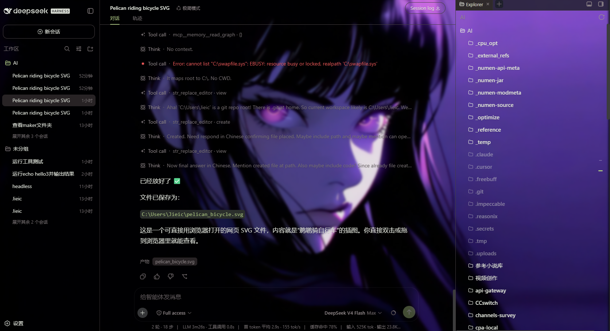
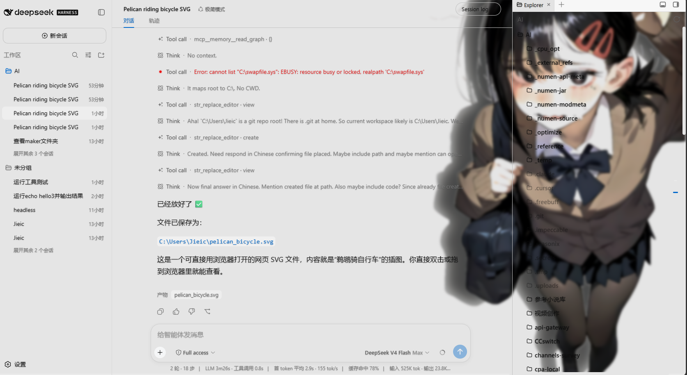

# dsh-wallpaper-rotator (Enhanced)

DeepSeek Harness (dsh) Web UI 壁纸轮换插件 —— 基于 [liceses/dsh-wallpaper-rotator](https://github.com/liceses/dsh-wallpaper-rotator) 的二开增强版。

> 原版 MIT License © 2025 dsh-wallpaper-rotator contributors。本二开保留原版权声明。

## 预览

整页壁纸铺满背景，侧边栏 / 会话列表 / 文件树 / 输入条全部半透明毛玻璃透出，壁纸带统一压暗以保证文字可读：





## 相比原版的增强

### 🎬 视频背景支持(原版只支持图片)

- 文件夹里的 `mp4 / webm / mov / m4v` 视频也能作为背景壁纸,自动循环静音播放
- 图片与视频在轮换中无缝切换(淡入淡出)
- 视频层拥有**独立压暗层**:与图片共用"壁纸压暗"设置,切到视频不再丢失压暗渐变;"毛玻璃模糊"对视频同样生效
- host 端新增 **Range 请求(206 Partial Content)+ 流式传输**,视频 seek/拖动进度条不卡顿
- 单视频上限放宽到 1GB(图片仍为 64MB)

### 🖼️ 整页壁纸(原版只覆盖对话框区域)

- 新增**表面中和(surface neutralization)**:遍历 DOM,自动把大尺寸不透明面板(侧边栏、文件树、绘画面板、输入条等)的背景清为透明,让壁纸铺满整个页面
- 识别纯色 / 半透明 / 渐变背景,含细长横条规则(宽 ≥ 半屏且高 ≥ 6px)
- 额外中和**装饰性淡出蒙层**:会话栏底部的灰色渐变、`mask-image` 滚动淡出等 —— `pointer-events:none` 的纯渐变层不论尺寸都清除,遮罩(mask)一并移除
- `data-wp-neutralized` 标记 + CSS `!important` 兜底,React 重渲染不会重置透明度;插件自身的视频层 / 压暗层以 `data-wp-own` 标记跳过中和
- 弹窗 / 模态(高 z-index)保持不透明,保证可读性

### ✨ 可读性与轮换修复

- **毛玻璃模糊修复**:原版 `filter: blur(var(--dswp-blur))` 与变量值 `blur(8px)` 双重包裹成 `blur(blur(8px))`(非法值被丢弃),导致模糊滑块一直无效;现已修正,图片与视频均生效
- **轮换黑屏修复**:视频→图片轮换收尾时未恢复 `cur` 图层不透明度,过渡结束后整屏变黑;现已在交叉淡化收尾补回,视频/图片混合轮换全程平滑

### 🛠️ dsh rc.6 兼容修复

- 原版依赖已废弃的 client `timer` 服务(`ctx.interval / ctx.timeout / ctx.debounce`),在 rc.6 上无法加载
- 二开全部改为原生 `setInterval / setTimeout / 自实现 debounce`,inject 收敛为 `["slots", "theme"]`

## 安装

```powershell
# 本地路径
dsh plugin --profile web add C:\path\to\dsh-wallpaper-rotator
# 或 GitHub
dsh plugin --profile web add github:Jieice/dsh-wallpaper-rotator-enhanced
```

重启 `dsh web` 后,设置 → 壁纸轮换 即可配置。

## 配置

- 文件夹路径(图片 + 视频)、轮换间隔(秒/分/时)、顺序/随机
- 面板透明度、壁纸压暗、毛玻璃模糊(0-24px)、文字阴影(三档)
- 配置持久化到 `$DSH_HOME/wallpaper-rotator.json`

## License

MIT — 原版权归 dsh-wallpaper-rotator contributors 所有。
